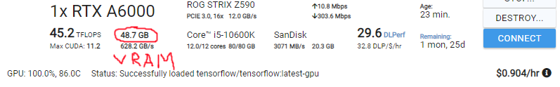
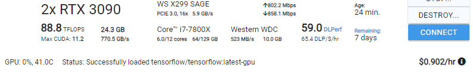

# Scrapy Scraper


## Installation

### Installation - Standalone

###### 1. Download

Download and unzip the file.


###### 2. Run install .bat or .sh

--(Windows)--

Go to /install and run:
``` install.bat ```

Wait until it says it is finished

--(MacOSx)--

Go to /install and run:
``` install.sh ```

Wait until it says it is finished

###### 3. Running program

Go to the main directory and run:
``` run_program.bat ```


### Installation - Dev

The following consists of very basic instructions.

###### 1. Setup git

Download the project through bitbucket / scourcetree, pull, ect...

###### 2. Run install .bat or .sh

--(Windows)--

Go to /install and run:
``` install.bat ```

Wait until it says it is finished

--(MacOSx)--

Go to /install and run:
``` install.sh ```

Wait until it says it is finished

###### 3. Running program

There are several methods to run the scraper.

###### (1) - Run file
Go to the main directory and run:
``` run_program.bat ```

###### (2) - Command Line - Relative (Windows)

Using cmd or other command line equivelent, change directory (cd) to the project.
After this run the following command.

Full argument:

```install\\python_install\\python scraper_run.py```

If you are working with the scraper it is probably important that you understand what this is doing.
The command consists of 2 parts, the path to the python executable and the path to the python(.py) file to run.

1st part:

```install\\python_install\\python ```

2nd part:

```scraper_run.py```

In additon to this arguments may be added.

###### (3) - Python Install

###### Step 1 - Install python
While the program can be run using the relative isntallation, this does not leand itself well to development as
for example you cannot easily install additional libaries.

Install python, if you dont know how look it up https://www.python.org/

###### Step 1.5 (optional) - Setup a vertual environment

--

###### Step 2 - Install the required libaries

Using command line / terminal (macOS) cd to the install directory and install the reqirments.txt

```pip install -r requirements.txt```


###### Step 3 - Run

Now you can run the scraper aswell as other files in the project.

```python {name of file you want to run}```

You probably know what you are doing.


### How Scrapy Works - ish (WIP)
The spiders folder is where more individual logic and code for both broad crawl spiders and per website scraping is held.
A new spider can be made by just copying the code of one to a new file and changing the requisite values. You can then work from there.


##### 'spiderdatautils.py'
is a utilities file with some functions for scraping and dataprocessing.

##### 'settings.py'
its settings for scrapy.

##### 'piplines.py'
this is where data coming out of the spiders is handled and manipulated.
It is basically the next step after data is collected by a spider.
Once a spider has finished scraping, pipelines processes and filters the data and then uploads it to the database.


##### 'middlewares.py'
the middlewares file is responsable for the 'connection' and 'content' that are retrived when a website is visited.
Normally a scraper visits a website and just grabs the first version of the page that exists, this is a problem however.
The reason this is a problem, is because sometimes there is dynamic content (content that is loaded with javascript run on your end or server stuff)
that is not loaded when just retriving the page scource.

The solution to this is to load the page in a similar way to if you opened it yourself on your browser. This involves a different web scraler libary called selenium.
Selenium docs: https://selenium-python.readthedocs.io/


Selenium is different to scrapy because it uses a webdriver, in this case chrome.

To understand Selenium I recommend setting up a test project and following the getting started page in the docs: https://selenium-python.readthedocs.io/getting-started.html
Additonally you must have google chrome installed and must ensure the version of chrome matches the chromedriver/chromedriver.exe file in the ``` install\chrome_driver ``` directoty,
if you are getting version errors you can swap that chromedriver file out here: https://chromedriver.chromium.org/downloads

So using this driver, instead of scrapy requesting the web page, scrapy asks the Selenium driver code in middlewares to load the page,
then the middlewares gives the loaded page back to scrapy.

To learn more about dowloader middlewares: https://docs.scrapy.org/en/latest/topics/downloader-middleware.html


### How pdf-extraction works - ish (WIP)

#### 'nn_extraction.py'
This is the runtime code for the nueral network.
##### What is the neural network
The neural network is specifically an "object detection" neural network.  
Stats:  
> - Type of Model Archetecture: Yolov5
> - Pipeline: https://github.com/ultralytics/yolov5
> - Image Inference Size: 640x640
> - Prefered Checkpoint (if you want to use ckpt): yolov5m.pt

##### Training - Setup
While you many not need to understand the how the training process was conducted, you may also want to know.
>In order to train, package or edit this neural network you will need to setup a kind of pipline/environment to do you work in.
>These are the steps for such a process, you can find more info on the internet.
> - First you should create a seperate python environment.
> - Create a seperate neural network creation/testing directory on you computer, hence forward refered to as "nn_dir".
> - Download this repo https://github.com/ultralytics/yolov5 and place in the nn_dir, this file will hence forward be refered to as "yolo_dir".
> - Install jupyter notebook if you havent already (may need the conda version if it acts up).
> - Use jupyter notebook to access the tutorial file in yolo_dir, learn a bit, understand a bit.
> - Within this super scrapper project there is a folder called "model_functions", copy this to a different place, this is used for data preperation, i recommend the nn_dir, this will be refered to as "modle_train_dir".
> - Once you copy it over you will want to run the main.py file in modle_train_dir, this will auto generate a file structure, look inside main.py for arguments and paramaters.
> - If you want the data that the network was trained with is here: https://deakin365.sharepoint.com/sites/WebMoCo.-UG/Shared%20Documents/Super%20Scrapper/Table-Detection%20Stuff/TrainingLabels.zip
> - Unzip and place corrisponding train and test files into the modle_train_dir/images directory, you now have the data used for this modle.
> - If you want to collect more data for the modle you can use a program called labelImg, its a python libary, go here: https://github.com/tzutalin/labelImg and you download, install and run it.
> - When labeling images, make sure that when you finish labeling you have labeled them in the right format, if you havent, just use a converter, they are everywhere, you may find this one useful: https://gist.github.com/Amir22010/a99f18ca19112bc7db0872a36a03a1ec

##### Training - Running
>Now lets say you wanted to train a new network or improve this network with new data, depending on you GPU you might be able to do it with your own computer, propably not tho.
>When training object detection networks the main bottleneck you will face is VRAM (GPU RAM), turns out images are rather large, especially when you load 16-32 of them at the same time.
>For reference 'I' have a GTX970, it has 4GB of VRAM, this model was trained with something along the lines of 45GB of VRAM or in other words 10 times more VRAM than a GTX970 and 2 times more VRAM than a GTX3090.
>The current model used a batch size of around 16ish, you could also use 8, 32 is possibly too much and 4 may be too low.
>The best way to train a model like this is to rent one (you will not need much money if you do this), DO NOT USE SOMETHING LIKE AMAZON, they will drain every penny you own.
>If you need to rent a GPU i HIGHLY recommend: https://vast.ai/ , basically its ebay but for GPU renting/leasing, they advertise prices ~3-5 times less than the big bois, in my experience you can get like 8 times cheaper.
>For reference this modle cost around $2-5 to train, and that includes the several hours i spent testing stuff.
>Anything with around 24-50 VRAM should be suffice. You could probably squeeze for lower tho.
>This is a good example of a really nice find (can get for cheaper):
>  
>Here there are two 3090s for a total of 50GB, you could do it for half the price with just 1 GPU at 24GB VRAM. (you can train in parallel if you want)
>  
>NOTE: If you are looking for a machine, regardless of what service you use, you should make sure that the CPU that is being used has "avx2" support, to find this out just lookup the CPU stats.  
>Now go look in the model_functions file for the "train_commands.txt" for info

##### Running Inference with onnx (:
>This was somewhat painful to setup, and it required finding niche threads and addapting and combining different solutions and setups found.  
>But now it is here (:.
>Function: 'run_pdf_table_detection' This is the main function for running the inference.  
>Class: 'onnx_detection_handler'  
>This is the nueral network inference class, it can take in a path to the nueral network modle as an initialization parameter.  
>If you having problems with the stuff here there are also some links in the code.


#### 'pdf_extraction.py'
This is the runtime code for the pdf extraction. Refer to code and video presentation to understand the process of this code.  

In summary pdf_extraction will use file urls cached in the database and get the data within them. After this the nerual network will detect tables, after this a series of process will be run to extract the data, please see demo video and the code file for more detail. (:


#### 'DocHandling.py'
This code acts as the intemediary between "scraper_run"/database and "pdf_extraction.py"
It also checks if files are related to the APIR codes, one thing of note is that there was a function which was removed, it would only accept files that were only related to 1 APIR code. This was removed because now data is collected from things like factsheets. The problem is that now there is currently no differentiation for stuff like factsheets, this needs to be implemented so that data for one fund is not listed as data from another fund.  

When files are checked for thier APIR/other stuff relation, the file urls are cached in the database.

Once these urls are catagorized and stored then the next part to actually extract the data from the pdfs, there is a function that handles the pdf_extraction operations, please go look at pdf_extraction for infomation


