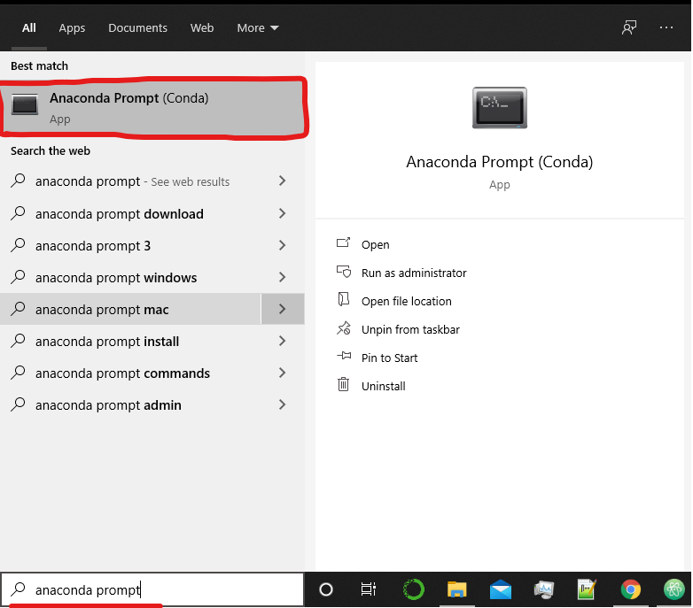

# Scrapy Scraper


### Installation

###### 1. Install Anaconda(Python)

In order to run the scraper you will need to install anaconda (data science python package handler and environment)

Go to the website using this link:
https://www.anaconda.com/products/individual

Click download and choose the version in accordance with your OS.

Install anaconda, follow the installation instructions.

###### 2. Download the files

Download this repo.
It will be in a zip file, extract it.

###### 3. Change directory to the downloaded files

Navigate to the files that you just extracted and copy the directory address (underlined in red)


###### 4. Open Anaconda Prompt

Once anaconda is installed you will need to open anaconda prompt.

Search for 'anaconda prompt' and run it.




###### 5. Navigate to the extracted files in anaconda prompt

Enter the following command to navigate to the files:
``` cd {the directory address you copied} ```

Make sure that you successfully navigated to that directory

###### 6. Run the following commands

When running the commands type 'y' to accept when prompted.

``` conda deactivate ```

``` conda create --name ScrapperTest --file requirements.txt --channel default --channel conda-forge --channel anaconda ```

``` conda activate ScrapperTest ```

If this all works then the installation was successful


### How To Run This

In the anaconda prompt console (or in IDE ect..) type: 'python refreshbutton.py' .

This will run the scraper.


### How Scrapy Works - ish
The spiders folder is where more individual logic and code for spiders and per website scraping is held.
A new spider can be made by just copying the code of one to a new file and changing the requisite values.

More general and hopefully dynamic scraping coming in future, however there will always be an element of: Specific Logic for Specific Website

'spiderdatautils.py' is a utilities file with some hardcode right now, I will be expanded upon as/if spiders and logic become more dynamic and more utils are needed.

'settings.py' its settings

'piplines.py' this is basically where data coming out of the spiders is handled and manipulated, it goes in order and stuff there is a whole thing. Very useful


### Things to do

##### Documentation [PRIO: N/A] - ONGOING

Update documentation for all readme.md files. This includes 2 scraper files, 1 database one.

Specific stuff:
 - Add brief explanations for each spider.
 - Add explanations of functions in base spider class.
 - Add explanations of database - spider interaction in files: (base spider class, pipelines, scraper_run.py).
 - Add explanations of data cleaning and formatting in pipelines.
 - Add explanations of database document creation in pipelines.

General stuff:
 - Update documentation explaining how to install scrapy and requisite libraries, add documentation explaining other file interactions.
 - Outline future direction of scraper.
 - Some database documentation
 - Database table of variable types and what they mean/do.

Types of documentation:
 - Trello future features, direction, current tasks (very general) [Amount: small]
 - In code documentation [Amount: Large]
 - Readme.txt [Amount: Small]
 - Readme.md(like this) [Amount: Mid - Large]
 - Separate ms teams dev thread.

#### - Build basis for potential features to be expanded on / looked into -


##### Create domain and sitemap traversal spiders [PRIO: N/A] - NOT-DOING

The client expressed intrest in the possability of spiders that traverse sites in order to guide other scraping operations.
This effectivly involves creating spiders that traverse listings websites (websites that list superannuation and fund manager data).
The data extracted (eg: fund manager urls) can then serve as quiery parameters for website traversal spider,
they traverse and map the sites and the data is extracted.


##### Finish setting up case case specific data extraction for fund managers [PRIO: N/A] - NOT-DOING

Everything is here, the values and parameters as well as additonal catagories just need to be added & finetuned.

##### Finally get the backend scraper to work with the front end electron UI [PRIO: N/A] - NOT-DOING

Do some more indepth googling consider potential options (there will be different ways to approach this).
Set something up running and create some basic documentation for it.

##### Advanced PDF-Extraction [PRIO: N/A] - NOT-DOING

While the current PDF-Extraction works table and text detection is not as effective as I should be.
Look into viability of using advanced detection for pdf extraction.

#####  Intergrate Website Traversal inputs with runtime systems [PRIO: N/A] - NOT-DOING

Currently traversal is being issued traversal input parameters from the database.
Intergrate the issuing of website traversal using file commands or potentially UI.

##### Create more dynamic/universal superannuation site spiders [PRIO: N/A] - NOT-DOING

Currently the superannuation spiders are limited and specific to certain sites and data extraction processes.

Look into to creating more dynamic/universal superannuation spiders with different extraction processes.
This would involve doing some additional research on the superannuation sites with the context of the site traversal in mind.

Things that could be setup / ideas:
	- Use traversal page filters to find certain pages.
    - Look into extracting files such as pdfs that match filters.
    - Do some more reasearch to find if there are some more commenalities in files or pages for superannuation sites.
    - Look into creating advanced table and form extract using contextual infomation combined with page filtering.

This process could be tested initially (does not need to be refactoring).

##### Database handler / utils [PRIO: N/A] - NOT-DOING

As the database is expanded and more data objects, metadata objects and standardization is implemented it will become necessery to off load database interactions into a seperate model / utils.

Currently database connections are just done on the spot in the code.
A simple connection class exists, the problem is that when the connection class is used consequtivly throughout the code at runtime connections interfeare with each other,
this leads to connections closing and the program being unable to upload to the db.

A potential solution to this would be to have a set of database handler classes and utils. Specifically a master database connection class that handles connections.
Once a connection is established it would then be used for all following database connections until closed.

Additionally database item and collection handlers could be added:
	- Dataframe handlers
    - JSON object handlers
    - CSV and other format handlers
    - Dataframe and other object type storage & convertion ( convert -> push to db ) ( pull from db -> convert back )

These are some things that could be added.


## NOTE: Feel free to append to this document thingy or ask Hamish about stuff in it


# --
