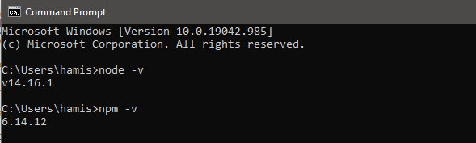
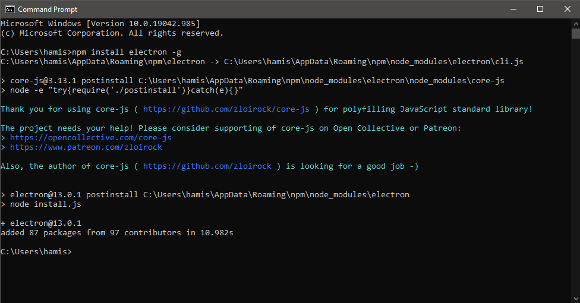

# Super Scraper – UI

## Installation

### Installation - Dev

###### 1. Install IDE/Text Editor

Any IDE or text editor will do, most popular editors have plugins and libaries for electron & webdev. However vscode has alot of relevant functionality out of the box with some nice plugins.
The UI team currently uses visual studio code.


###### 2. Install Node

Download Node.js from this link:
https://nodejs.org/en/download/

This will also install "npm" (node package manager)

Verify that node is installed by entering ``` node -v ``` into cmd or terminal(mac)

Verify that npm is installed by entering ``` npm -v ``` into cmd or terminal(mac)



###### 3. Install electron.js

Run the following command (-g is important):
``` npm install electron -g ```

The argument -g will ensure the the electron package is installed globally and thus avoid installing electron as a local package in the git files.

If experiencing errors & for futher infomation visit the electron website:
https://www.electronjs.org/



### ----


The Super Scraper’s UI team has researched and designed a User Interface that is going to be both user friendly and efficient. The designs were created on Figma and are represented through both low and hi- fi frames. When it came to building the desktop application, the team explored various platforms. We started off with using Python’s Tkinter, as this would have allowed seamless integration with the backend. However, this software did not meet our standards, thus, we have decided to use electron JS to build the desktop application. 

How to set up Electron Js – (Things you will need)

•	Download visual studio code 
•	Download Node Js
•	Download the corresponding files from UI branch on Bitbucket (existing code will be downloaded and you can add your work to  this)  

How to run 

•	In visual studio code  after saving your code you need to ‘debug & run’ 
•	On your terminal or command prompt navigate to where you have saved the code 
•	Once in that directory type: ‘npm start’ 
•	Now you will be able to see your desktop application running


Things that have been done

•	Created a functioning desktop application 
•	Created a User-friendly navigation bar 
•	Created and implemented logo for Super Scraper 
•	Added visual graphs to represent data (bar & line) 
•	Created search bar 
•	Allow for easy navigation through various windows 
•	Created drop down menus for each super fund and their offerings


Things to do 

•	Add more features upon client’s request 
•	Have a more seamless interface (minimal/ discuss colour scheme)  
•	Implement python code to electron (merging the backend with the font end)
•	Create functionable buttons (e.g., scrape button to activate scaping function, which can scrape new data from each super fund)
•	Display extracted data 
•	Change how data is represented  implement heat maps (further discussion required with client) 

